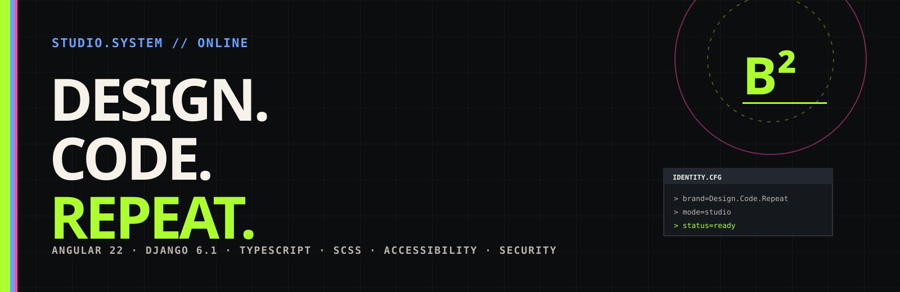

<p align="center">
  
</p>

<h1 align="center">Design. Code. Repeat. Studio</h1>

<p align="center">
  Firmenwebsite für Webentwicklung, individuelle Software, UI/UX, Wartung und Managed Hosting.<br>
  Technisch gebaut als eigenständige Studio-Plattform – bewusst getrennt vom persönlichen Portfolio.
</p>

<p align="center">
  <strong>Angular 22</strong> · <strong>TypeScript 6</strong> · <strong>SCSS</strong> · <strong>Django 6.1</strong> · <strong>Vitest</strong>
</p>

---

## `studio.system // overview`

Die Website verbindet einen klaren Agentur-/Studio-Auftritt mit der visuellen Sprache von **Design. Code. Repeat.**: harte Flächen, Terminal-Elemente, Pixel-/Dither-Ästhetik, starke Typografie, Light/Dark Mode und bewusst eingesetzte Motion.

Der Fokus liegt nicht auf einer experimentellen Portfolio-Experience, sondern auf einer professionellen, verständlichen Firmenwebsite mit klaren Leistungen, Referenzen, Kontaktwegen und technischer Tiefe.

### Kernbereiche

| Route | Inhalt |
| --- | --- |
| `/` | Startseite mit Hero, Leistungen, Referenzen, Prozess, FAQ und Kontakt |
| `/leistungen` | Leistungsübersicht, Wartung, Betrieb und Service-Detailrouten |
| `/leistungen/:slug` | SEO-fähige Detailseiten für einzelne Leistungen |
| `/referenzen` | Case Studies und horizontal inszenierte Kundenprojekte |
| `/studio` | Studio, Arbeitsweise, Prinzipien und persönliche Signatur |
| `/kontakt` | Kontaktformular |
| `/impressum` | Impressum |
| `/datenschutz` | Datenschutz |

---

## `stack.loaded`

### Frontend

- Angular 22 mit Standalone Components
- TypeScript 6
- SCSS mit zentralem Designsystem
- Angular Router mit Lazy Loading
- Signals für UI-/Content-State
- Vitest für Unit Tests
- lokale Fonts und Material Symbols
- WebGL-/Dither-Effekte ohne React-/Tailwind-Abhängigkeit

### Backend

- Django 6.1
- schlankes Kontakt-API
- CSRF-Schutz
- serverseitige Whitelist-Validierung
- Rate Limiting
- optional Redis für geteilte Rate-Limit-Zähler
- SMTP-Konfiguration ausschließlich über Environment-Variablen
- keine Persistierung von Kontaktanfragen

---

## `design.system`

Das Designsystem liegt zentral in `src/styles/tokens.scss`. Komponenten sollen keine eigenen festen Farbwerte einführen, sondern ausschließlich semantische Tokens verwenden.

Wichtige Akzente:

<table>
  <tr>
    <td><code>--dcr-color-bg</code></td>
    <td>Dark <code>#0b0d0f</code></td>
    <td>Light <code>#fbf7ee</code></td>
  </tr>
  <tr>
    <td><code>--dcr-color-lime</code></td>
    <td colspan="2"><code>#adff2f</code> / <code>#b8ff2e</code></td>
  </tr>
  <tr>
    <td><code>--dcr-color-primary</code></td>
    <td><code>#67a2ff</code></td>
    <td><code>#005fe8</code></td>
  </tr>
  <tr>
    <td><code>--dcr-color-pink</code></td>
    <td><code>#ff4ca5</code></td>
    <td><code>#ed2d88</code></td>
  </tr>
</table>

Zusätzlich existieren semantische `on-*`-Tokens für kontrastsichere Vordergrundfarben sowie Varianten für High Contrast und unterschiedliche Farbsehschwächen.

---

## `motion.rules`

Animationen sind Teil der Gestaltung, dürfen aber keine Voraussetzung für Bedienbarkeit sein.

- Body-Scroll bleibt die zentrale Scroll-Ebene.
- Scroll Snap wird nur dort eingesetzt, wo eine Section tatsächlich als Viewport-Komposition gedacht ist.
- Horizontale Projektbereiche werden über vertikalen Scrollfortschritt gepinnt.
- Reveal-, Dither- und Marquee-Effekte respektieren `prefers-reduced-motion`.
- Interaktionen bleiben per Tastatur nutzbar.
- Motion wird möglichst transform-/opacity-basiert umgesetzt.

---

## `project.structure`

```text
.
├── backend/
│   ├── config/                 # Django-Konfiguration
│   ├── contact/                # Kontakt-API, Validierung und Mailversand
│   ├── .env.example            # Development-Template
│   └── .env.production.example # Production-Template ohne Secrets
├── docs/
│   ├── readme/                 # README-Assets
│   ├── phase-2-architecture.md
│   └── security.md
├── src/
│   ├── app/
│   │   ├── core/               # Services, Content, Models
│   │   ├── layout/             # Header, Footer und globale Layoutteile
│   │   ├── pages/              # Routen / Seiten
│   │   └── shared/             # Wiederverwendbare UI-/Motion-Komponenten
│   ├── assets/                 # Fonts, Bilder und statische Assets
│   ├── environments/           # Angular Development / Production
│   └── styles/                 # Tokens, Base, Utilities und globale Styles
├── angular.json
├── proxy.conf.json
└── package.json
```

---

## `environment.setup`

### Angular Development

`src/environments/environment.ts` ist für die lokale Entwicklung vorkonfiguriert:

```ts
export const environment = {
  production: false,
  siteUrl: 'http://localhost:4200',
  apiBaseUrl: '/api',
} as const;
```

`/api` wird über `proxy.conf.json` an Django unter `http://127.0.0.1:8000` weitergereicht. Dadurch bleibt das Frontend same-origin und Angulars XSRF-/CSRF-Fluss funktioniert ohne zusätzliche CORS-Schicht.

### Angular Production

`src/environments/environment.production.ts` ist für die öffentliche Domain vorkonfiguriert:

```ts
siteUrl: 'https://design-code-repeat.de'
```

`apiBaseUrl` bleibt standardmäßig `/api`, weil das Django-Backend in Produktion vorzugsweise über denselben Host und einen Reverse Proxy bereitgestellt wird.

### Django Development

```bash
cd backend
python -m venv .venv
```

Windows:

```powershell
.\.venv\Scripts\Activate.ps1
pip install -r requirements.txt
Copy-Item .env.example .env
python manage.py runserver
```

Die Development-Konfiguration schreibt E-Mails standardmäßig in die Konsole, solange kein SMTP-Host gesetzt ist.

### Django Production

`backend/.env.production.example` nach `.env` kopieren und **alle Platzhalter sowie Secrets vor dem Start ersetzen**.

Besonders relevant:

- `DJANGO_SECRET_KEY`
- `DJANGO_ALLOWED_HOSTS`
- `DJANGO_CSRF_TRUSTED_ORIGINS`
- `CONTACT_RECIPIENT`
- SMTP-Zugangsdaten
- optional `DJANGO_REDIS_URL`

`DJANGO_TRUST_PROXY_PROTO=true` darf nur gesetzt werden, wenn der vorgeschaltete Reverse Proxy `X-Forwarded-Proto` zuverlässig selbst überschreibt.

HSTS sollte erst erhöht werden, wenn HTTPS auf der finalen Domain vollständig geprüft ist.

> Frontend-Environments enthalten ausschließlich öffentliche Build-Konfiguration. Zugangsdaten, API-Secrets oder SMTP-Passwörter gehören niemals in `src/environments`.

---

## `development`

### Voraussetzungen

- Node.js `^22.22.3`, `^24.15.0` oder `^26.0.0`
- npm `>=10`
- Python mit Django-6.1-Unterstützung

### Frontend starten

```bash
npm install
npm start
```

Angular läuft standardmäßig unter:

```text
http://localhost:4200
```

### Production-Build

```bash
npm run build:production
```

Output für das statische Frontend-Deployment:

```text
dist/design-code-repeat-studio/browser/
```

Nur der Inhalt des `browser`-Ordners wird in den öffentlichen KeyHelp-Webspace kopiert. Repository-Dateien wie `README.md`, `LICENSE`, `src/`, `backend/`, `.git/` oder `node_modules/` werden nicht ausgeliefert.

Die aktuelle Vorab-Konfiguration blockiert Suchmaschinen über `src/robots.txt` und setzt zusätzlich `noindex, nofollow` über den SEO-Service. Vor dem öffentlichen Launch müssen `src/robots.txt` und die `robots`-Werte in den Environment-Dateien bewusst auf Indexierung umgestellt werden.

### Tests

```bash
npm test
npm run test:ci
```

---

## `quality.gates`

Bei Änderungen sollten mindestens folgende Punkte geprüft werden:

- Light und Dark Mode
- High-Contrast-Modus
- Tastaturnavigation und sichtbare Fokuszustände
- `prefers-reduced-motion`
- Responsive Layouts inklusive niedriger Viewport-Höhen
- Kontrast der verwendeten Token-Paare
- Angular Build und Tests
- Kontaktformular gegen Frontend- **und** Backend-Validierung
- keine Secrets oder produktiven Zugangsdaten im Repository

---

## `security`

Das Frontend wird nicht als Sicherheitsgrenze betrachtet. Das Django-Backend validiert alle Kontaktanfragen erneut, akzeptiert nur definierte Felder und übernimmt CSRF-, Rate-Limit- und Mail-Sicherheitslogik.

Weitere Details: [`docs/security.md`](docs/security.md)

---

## `license`

Dieses Projekt ist proprietär und nicht zur freien Wiederverwendung freigegeben.

Siehe [`LICENSE`](LICENSE).

<p align="center">
  <strong>DESIGN. CODE. REPEAT.</strong><br>
  <code>B² // studio.system</code>
</p>
